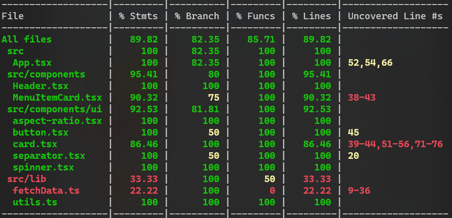

<!-- Introduction Text -->

    <h1>Take-Home Assaignment</h1>
    <h3>React/Vite app handeling data <h3>
    <h3> 
      <a href='', target='_blank'>
        <h5>live demo</h5>
      <a/>
    </h3>
        <h6>
            built with <a href="https://vitejs.dev/" >Vite</a> &
            hosted by <a href="https://vercel.com/">Vercel</a> 
        </h6>

---

<h3 align='center'>
Tech Used in this Project
<h3>

    <a href="https://skillicons.dev">
         
        
        
    </a>

---

<!-- DEMO IMAGE  -->
🎯 INSERT DEMO IMAGES

     
        

 

<!-- -------------------------------------------------------------------------- -->

<h1 align='center'> Welcome & Introductory </h1>

<!-- -------------------------------------------------------------------------- -->

### Introduction:

<!-- -------------------------------------------------------------------------- -->

Despite a hectic schedule, I took on the challenge of developing a React-based solution to render Flipdish restaurant menus. 
This project was part of a time-constrained technical assessment. 

Leveraging modern technologies including React, Typescript, and Tailwind CSS, I prioritized delivering essential functionality while ensuring clean, scalable code. You can explore my development journey through detailed comments on commits 

You can find more information of development journal in the [comments on git commits](https://github.com/DevonGifford/Menu--TechnicalAssignment/commits/main)

 

<!-- -------------------------------------------------------------------------- -->

 

### 🔑 Key-Required Features of this project:

<!-- -------------------------------------------------------------------------- -->

##### REQUIRED FEATURES: 

#### React-based solution to render the menu in a browser:

✅  Renders full menu with the variouse categories as well as individual menu items

✅  Individual menu item's include:  name, image, description & price <em>( if available... )</em>

✅  Web app is fully Mobile/User-friendly and responsive.

 

#### Read and understand the structure of the Flipdish menu data object:

✅  Fetch and handle data from API endpoint  

✅  Products with `isMasterOptionSet` set to true should be standalone products

✅  Ignores `MenuSectionItem` when `isMasterOptionSet` is true

 

##### STRETCH FEATURES: 

✅  Polished UI - interactive w/ Loading elements (hover effects, transitions, animations)

✅  Unit/integration testing with vitests and RTL.

✅  Navigation controls for users to easily navigate to the top of the menu.

 

---

### 🎯 Known issues and potential improvements:

<!-- -------------------------------------------------------------------------- -->

<!-- Small container -->

 Click here to expand

 

#### Known issues: 

💥  

 

#### Future Features & Improvements: 

🥊  Implement accessibility features to ensure the menu is usable for people with disabilities (e.g., screen readers).

🥊  Include a feature to filter or search for specific menu items or sections.

💥  Implement a feature for users to customize menu items (e.g., select options, add extras).

💥  Include a shopping cart functionality to allow users to add items for ordering.

💥  Integrate with a backend or API for real-time updates or ordering functionality.

<!-- CLOSING DIV -->

  

<!-- SECTION CLOSING DIV -->

  

<!-- -------------------------------------------------------------------------- -->

<h1 align='left'> Testing Results 🧪</h1>

<!-- -------------------------------------------------------------------------- -->

 Click here to expand 

 

🎯 INSERT TESTING COVERAGE IMAGES

 

<!-- CLOSING DIV -->

  
